# Trojan SQL

## How to mess up other peoples databases by spiking SQL statements with spurious Unicode control characters

Note: This was a presentation for the rc3 in 2021 that was ultimately rejected
--

## What is it all about?

---

### What is it all about?

* Trojan Source: Invisible Vulnerabilities https://arxiv.org/abs/2111.00169<!-- .element: class="xxx-small"-->  
➤ C#, C++, C, Go, Java, JavaScript, Python, Rust
* Source code examples https://github.com/nickboucher/trojan-source<!-- .element: class="xxx-small"-->
* OpenSource - we all review code from third parties we use in our own projects - right? 
* **The reviewer (human) sees different things from the ones the computer actually does**

Note: 
* There was a vulnerability detected that played on the "it security is technically solved - it is the humans who are responsible whenever it fails"-thing:
* The attack vector being here that some developer / tester / administrator is stressed and gets a snippet of SQL (or any interpreted language for that matter)
and executes it after only a casual glance at its content

---

### How?

#### What the Reviewer sees

```java
	public static void main(String[] args) {
		boolean isAdmin = false;
		/* begin admins only */ if (isAdmin)
		{
			System.out.println("You are an admin.");
		} /* end admins only */
	}
```

#### What the Compiler sees

```java
	public static void main(String[] args) {
		boolean isAdmin = false;
		/* begin admins only if (isAdmin) */
		{
			System.out.println("You are an admin.");
		} /* end admins only */
	}
```
Note:
* The vulnerability concerns every tool that displays human readable text - from terminals to editors to IDEs or even database tools
---

### Why SQL?

* Original article: programming languages,  
mostly compilers
* Interested in the potential to harm in  
  **interpreted/non-programming** languages
* Prone to attacks (SQL injection anyone?)
* Same pattern as in the original article:  
There is **human-readable text** -  
human checks it, computer interprets and executes it

Note:
* The first idea was funny stuff in identifiers in sql scripts
* after that, the idea of messing with where clauses in UPDATE statements materialized
* and then i began to think about interpreted languages in general
* finally (for now) the focus shifted towards Domain specific languages
--

## Responsible Disclosure

---
 
### Responsible Disclosure

* I informed the maintainers about my findings
* Bad turnaround/feedback
* Difficult, because there are so many

Note:
* obviously there are two opinions about the severity of this vulnerability - more on that towards the end of the presentation

--

## The Inspiration

---

### Mastodon and funny column names (Emojis)

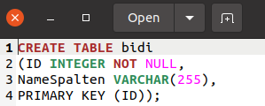
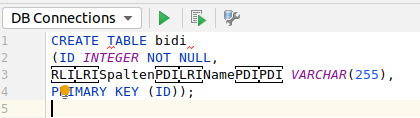

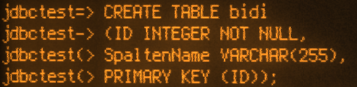

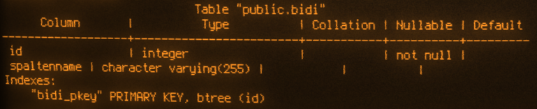
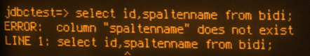

Note:
* I got the inspiration from mastodon - someone had made a table in postgresql with only animal emojis as column names
* what we see here is the result of introducing invisible bidi control characters in identifiers
* i used psql for these tests

--

## Lets get down to brass tacks...

---

### What we need

* Reviewer needs to see different  
text than the DBMS executes
* Introduced special control characters  
are ignored by the DBMS and elicit no syntax violation errors

Note:
* it all cooks down essentially to those two things
---

### About the review

* Source code management (Git-Lab|-Hub|-ea)
* Editors (IDE)
* Database tools
* Databases
* Data transfer (EMail?)

The probe (as the reviewer sees it):

```sql
select * from example where name<>'John' -- this is a comment
```
The probe (as the database sees it):

```sql
select * from example where name<>'John -- this is a comment'
```

Note: behold the position of the quote marking the end of the string literal...
---

### What does **not** get reviewed?

**This is no product recommendation nor is it exhaustive!**

* VisualCode
* Sublime
* Mac
* ...

Note:
* Mac for religious reasons
* Visual Code and Sublime are only examples for the no doubt many tools dealing with source codes out there...

---

### Does it really work?

#### The table

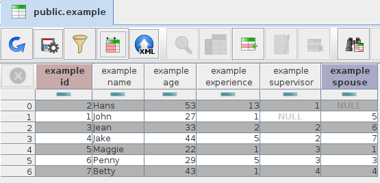

Note:

* what we see here is a Table with some example data
* important is the column name and the row where this column holds the value John

---

### Does it really work?

#### What the reviewer expects

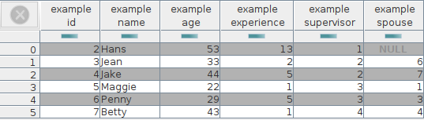

#### What the DBMS returns

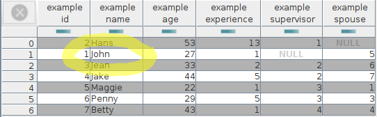

Note:
* we see that the row with John is returned albeit it was excluded by the where clause
---

### Is it possible for the reviewer to spot it?

#### Valid


### Attack!

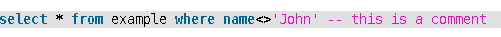

Note:

* It would have been possible to spot it as the quote seemingly closed the string literal directly after john but the syntax highlighting hints at the actual fact - that the string extends until the end of the line
* Many tools show this behaviour

---

### What is reviewed?

* Source code management
* Editors (IDE)
* Database Tools
* Databases
* Data Transfer

--

## Source code management

---

### Source code management

* Gitlab
* Github 
* Gitea (Codeberg!)

---

### Source code management

* Gitlab 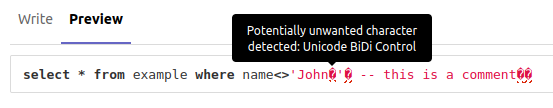
* Github 
* Gitea 

Note:
* every aspect where Source Code can be introduced is secured like that: files in the repository as well as gists and descriptions/comments in issues
---

### Source code management

* Gitlab 
* Github 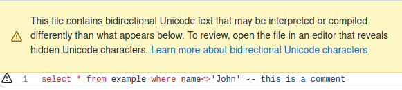
* Gitea 

Note:
* files in the repository as well as gists
---

### Source code management

* Gitlab 
* Github <span>☠</span><!-- .element: class="xx-large"--> 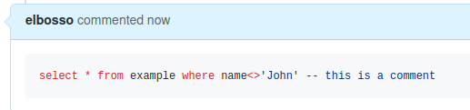
* Gitea 

Note:
* not every aspect where Source Code can be introduced is secured like that: descriptions/comments in issues **are not**

---

### Source code management

* Gitlab 
* Github <span>☠</span><!-- .element: class="x-large"--> 
* Gitea <span>☠</span><!-- .element: class="xx-large"--> 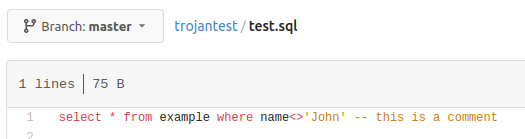  
<span>there is a pull request</span><!-- .element: class="xxx-small"--> https://github.com/go-gitea/gitea/pull/17562<!-- .element: class="xxx-small"-->

---

### Source code management

* Gitlab 
* Github <span>☠</span><!-- .element: class="x-large"--> 
* Gitea <span>☠</span><!-- .element: class="xx-large"--> 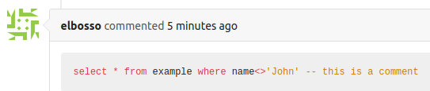  
<span>there is a pull request</span><!-- .element: class="xxx-small"--> https://github.com/go-gitea/gitea/pull/17562<!-- .element: class="xxx-small"-->

Note:
* **No** aspect where Source Code can be introduced is secured like that: files in the repository as well as gists and descriptions/comments in issues
* The pull request is still - months after the vulnerability was made public - debated concerning the actual fine points of the visuals for the warning
--

## EDITORS (IDE)

---

### Editors (IDE)

* Gedit
* Kate
* Notepad++
* Editor (Windows)
* Terminal (vim)
* Intellij Idea

---

### Editors (IDE)

* Gedit 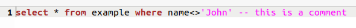
* Kate
* Notepad++
* Editor (Windows)
* Terminal (vim)
* Intellij Idea

---

### Editors (IDE)

* Gedit 
* Kate 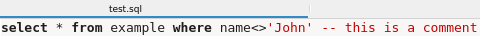
* Notepad++
* Editor (Windows)
* Terminal (vim)
* Intellij Idea

---

### Editors (IDE)

* Gedit 
* Kate 
* Notepad++
* Editor (Windows)
* Terminal (vim) 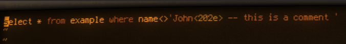
* Intellij Idea

Note:
Would the proposal have been accepted, I would have made the effort to look at the windows editors too - now it is an exercise left for the reader...

---

### Editors (IDE)

* Gedit 
* Kate 
* Notepad++
* Editor (Windows)
* Terminal **(joe)** 
* Intellij Idea

---

### Editors (IDE)

* Gedit 
* Kate 
* Notepad++
* Editor (Windows)
* Terminal **(nano)** 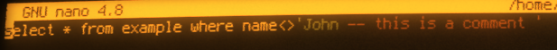
* Intellij Idea

---

### Editors (IDE)

* Gedit 
* Kate 
* Notepad++
* Editor (Windows)
* Terminal (nano) 
* Intellij Idea 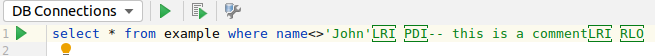

---

### Editors - a Digression

#### BeanShell Console latest release

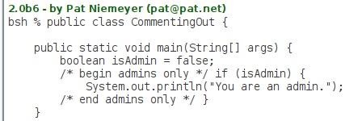

#### BeanShell Console 3.0.0-SNAPSHOT Fork

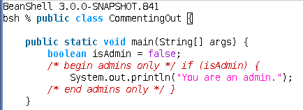  
https://github.com/elbosso/beanshell<!-- .element: class="xxx-small"-->

Note:
This is a special case where a normally compiled language is interpreted

---

### Editors - a Digression

#### BeanShell Console latest release


#### BeanShell Console 3.0.0-SNAPSHOT Fork

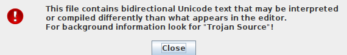  
https://github.com/elbosso/beanshell<!-- .element: class="xxx-small"-->

Note:
The newly added syntax highlighting does only that - see what was said at the begin of the presentation, therefore, a warning dialog pops open whenever Text is loaded into the editor or pasted

--

## Database Tools

---

### Database Tools

* SQL Developer
* MSSQL Server Studio
* sQLshell
* phpMyAdmin
* pgAdmin

---

### Database Tools

* SQL Developer 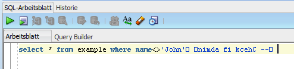
* MSSQL Server Studio
* sQLshell
* phpMyAdmin
* pgAdmin

---

### Database Tools

* SQL Developer 
* MSSQL Server Studio 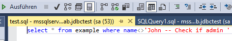
* sQLshell
* phpMyAdmin
* pgAdmin

---

### Database Tools

* SQL Developer 
* MSSQL Server Studio 
* sQLshell 
* phpMyAdmin
* pgAdmin

Note:
Would the proposal have been accepted, I would have made the effort to look at the web frontends too - now it is an exercise left for the reader...

--

## Databases

---

### Databases

* Oracle
* <span>Postgres </span><span>✓</span><!-- .element: class="xx-large"-->
* <span>MS SQL Server </span><span>✓</span><!-- .element: class="xx-large"-->

Note:
Would the proposal have been accepted, I would have made the effort to look at oracle too - now it is an exercise left for the reader...


--

## Data Transfer

---

### Data Transfer

* Outlook
* Thunderbird
Note:
Would the proposal have been accepted, I would have made the effort to look at those too - now it is an exercise left for the reader...

--

## What could be next?

* Analysis of applications on Mac
* Management of instigated bug reports
* Trojan NoSQL perhaps?
* Other interpreted or Domain Specific Languages (DSLs)
* Urge other developers to mitigate https://github.com/nickboucher/bidi-viewer<!-- .element: class="xxx-small"-->
* Please give me feedback about your favorite Tool/Editor/...!
* Live version and sources of slides will be available on Github

---

### Please, reach out for questions/ideas/...!
Coordinates (Github, Gitlab, Mastodon, XMPP, EMail,...)  
can be found on  
https://elbosso.github.io/index.html  
or  
https://github.com/elbosso

